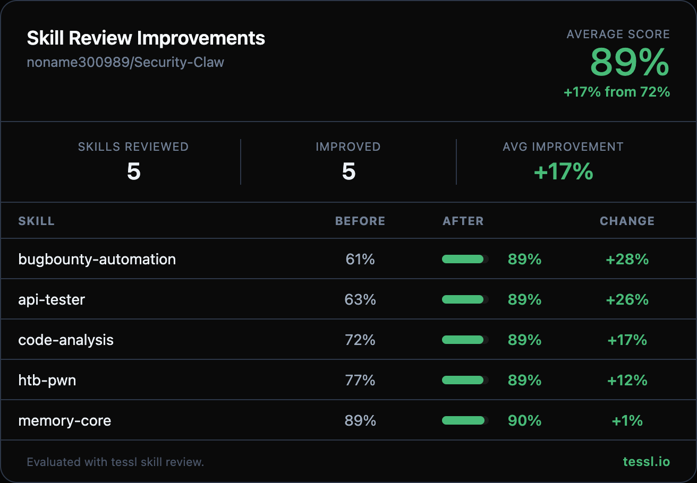

Hey @noname300989 👋

I ran your skills through `tessl skill review` at work and found some targeted improvements. Here's the full before/after:

| Skill | Before | After | Change |
|-------|--------|-------|--------|
| bugbounty-automation | 61% | 89% | +28% |
| api-tester | 63% | 89% | +26% |
| code-analysis | 72% | 89% | +17% |
| htb-pwn | 77% | 89% | +12% |
| memory-core | 89% | 90% | +1% |

## Summary

- Problem: Several skills had low review scores due to missing workflow structure, verbose content Claude already knows, and absent "Use when..." trigger clauses.
- Why it matters: Higher-scoring skills get selected more reliably by agents and produce better results with less token waste.
- What changed: Optimized 5 skills — added workflow sequencing, validation checkpoints, "Use when..." clauses, trimmed redundant content, and converted description formats to quoted strings.
- What did NOT change (scope boundary): No tool logic, scripts, or non-skill files were modified. Domain expertise and all executable commands were preserved.

Changes summary

**bugbounty-automation (+28%)** — biggest win:
- Cut from 672 → 383 lines (was over the 500-line validation limit)
- Removed ~100 lines of WAF bypass payload lists Claude can generate on demand — replaced with a strategy table
- Added "Use when..." clause to description
- Added tool availability validation checkpoint and scope verification before active testing
- Trimmed broadcast message examples and report template to compact formats
- Removed duplicate "Usage from Agent" section
- Converted description from pipe (`|`) to quoted string format

**api-tester (+26%)**:
- Cut from 471 → 283 lines
- Added 8-step workflow with safety checkpoint for destructive operations
- Added "Use when..." clause to description
- Removed explanatory text about BOLA, injection, rate limiting concepts Claude already knows
- Removed redundant "Usage:" prompt examples and Quick Reference section
- Added validation checkpoints (confirm true positives, re-fetch after mass assignment)
- Converted description from pipe to quoted string format

**code-analysis (+17%)**:
- Added 6-phase sequenced workflow (SAST → Triage → SCA → Secrets → IaC/DAST → Validate Fixes)
- Added "Use when..." clause to description
- Added triage guidance for confirming true vs false positives
- Added verify-fix loop (re-scan after remediation)
- Removed "Usage:" prompt examples and tool explainer sentences
- Converted description from pipe to quoted string format

**htb-pwn (+12%)**:
- Added validation checkpoints and error recovery throughout all phases (token check, VPN/ping failure, zero ports recovery, flag submission feedback loop)
- Added "Use when..." clause to description
- Trimmed broadcast section from full per-channel examples to compact template + channel table
- Added reference to sibling `scripts/htb_auto.py` for detailed implementation
- Converted description from pipe to quoted string format

**memory-core (+1%)**:
- Removed verbose "When to Use" / "When NOT to Use" sections
- Removed "Usage from Agent" natural language examples
- Added 3-step workflow (Search → Retrieve → Apply)
- Added example response showing data shape for `memory_search`
- Added guidance for handling empty search results

## Change Type (select all)

- [ ] Bug fix
- [ ] Feature
- [ ] Refactor
- [x] Docs
- [ ] Security hardening
- [ ] Chore/infra

## Scope (select all touched areas)

- [ ] Gateway / orchestration
- [x] Skills / tool execution
- [ ] Auth / tokens
- [ ] Memory / storage
- [ ] Integrations
- [ ] API / contracts
- [ ] UI / DX
- [ ] CI/CD / infra

## Linked Issue/PR

- N/A — unsolicited improvement contribution

## User-visible / Behavior Changes

None — skill documentation only. No runtime behavior, configs, or defaults changed.

## Security Impact (required)

- New permissions/capabilities? `No`
- Secrets/tokens handling changed? `No`
- New/changed network calls? `No`
- Command/tool execution surface changed? `No`
- Data access scope changed? `No`

## Repro + Verification

### Environment

- Tool: `tessl skill review` (tessl CLI)

### Steps

1. Run `tessl skill review skills/<name>/SKILL.md` on each of the 5 skills
2. Compare scores against the before/after table above

### Expected

- All 5 skills pass validation with scores matching the "After" column

### Actual

- All 5 skills score 89-90% after optimization

## Evidence

- [x] Screenshot/recording — see score card image above
- [x] Before/after `tessl skill review` output for all 5 skills

## Human Verification (required)

- Verified scenarios: Ran `tessl skill review` before and after each change, confirmed score improvements
- Edge cases checked: Verified bugbounty-automation is now under 500-line limit (was 672, now 383), confirmed all executable commands preserved
- What you did **not** verify: Runtime execution of the skills in a live agent session

## Compatibility / Migration

- Backward compatible? `Yes`
- Config/env changes? `No`
- Migration needed? `No`

## Failure Recovery (if this breaks)

- How to disable/revert this change quickly: `git revert <commit>`
- Files/config to restore: The 5 SKILL.md files in `skills/`
- Known bad symptoms reviewers should watch for: Skills not triggering correctly (unlikely — descriptions were expanded, not narrowed)

## Risks and Mitigations

- Risk: Trimmed content might remove something a specific user relied on reading in the skill file
  - Mitigation: All executable commands and domain-specific terminology preserved; only removed explanatory prose and concepts the agent already knows

---

Honest disclosure — I work at @tesslio where we build tooling around skills like these. Not a pitch - just saw room for improvement and wanted to contribute.

Want to self-improve your skills? Just point your agent (Claude Code, Codex, etc.) at [this Tessl guide](https://docs.tessl.io/evaluate/optimize-a-skill-using-best-practices) and ask it to optimize your skill. Ping me - [@yogesh-tessl](https://github.com/yogesh-tessl) - if you hit any snags.

Thanks in advance 🙏
